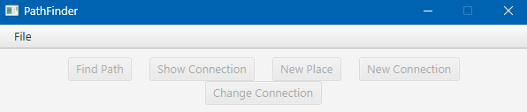
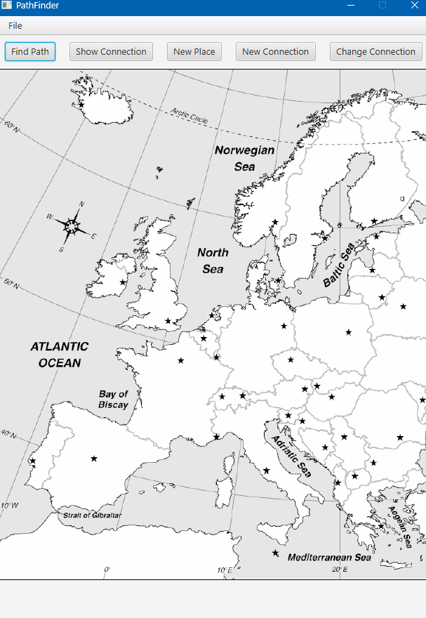
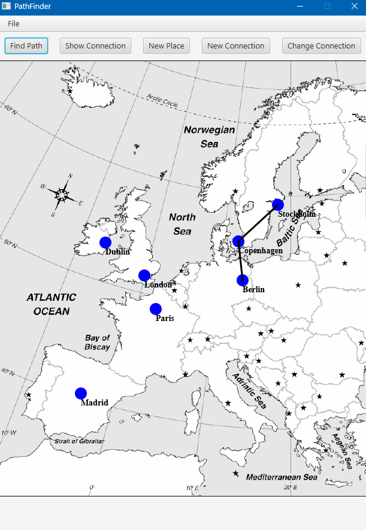
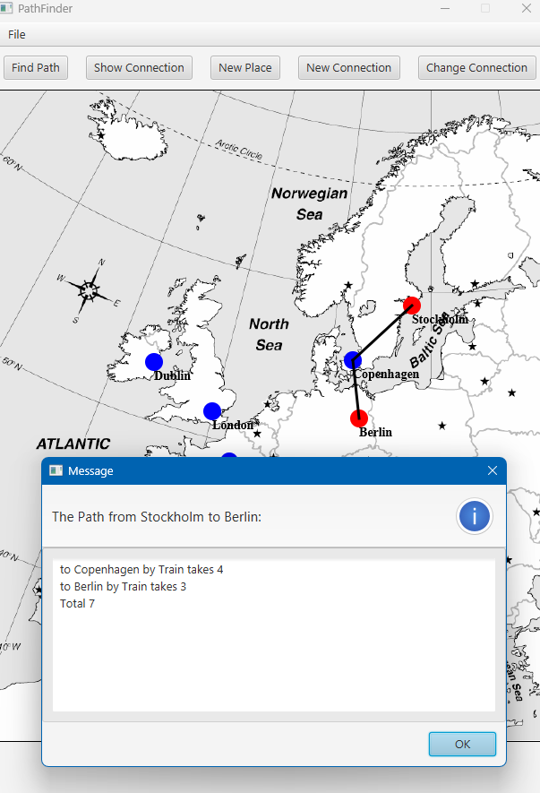

# PathFinder – Interactive Map Graph Builder (JavaFX)

PathFinder is a JavaFX application for interactively creating and visualizing graph structures (nodes and edges) on top of a map image. It's ideal for educational purposes, simulations, or travel planning visualizations.

## 🌍 Overview

This tool allows you to:
- Load a custom map image (e.g. a map of Europe)
- Add named locations (nodes) by clicking on the map
- Create named and weighted connections between nodes
- Find and visualize the shortest path between places
- Save and load graph configurations

Built with **Java SDK 22.0.2** and **JavaFX SDK 22.0.1**, this app combines modern Java capabilities with intuitive GUI design.

---

## ✨ Features

- 📍 **Add Places**: Click on the map to add a named location (node)
- 🔗 **Create Connections**: Connect two places with a named and weighted edge (e.g., "Train", 3)
- 📂 **File Menu**: Open map images and save/load graph files
- 🧭 **Find Path**: Calculate and display the shortest path between two selected nodes
- 🎨 **Visual Feedback**: Active/selected nodes and paths are shown with distinct colors
- ✅ **Dialog Driven**: Clean user interactions via JavaFX dialogs

---

## 🖼️ Screenshots

### 🔵 Start state
The program UI on startup, before loading a map:

### 🗺️ Map loaded
After loading a background map image:

### 📌 Nodes added
With places like London, Paris, and Berlin added:

### 🧭 Connections and pathfinding
After creating connections and finding the path from Stockholm to Berlin:

---

## ⚙️ Technology Stack

- Java SDK **22.0.2**
- JavaFX SDK **22.0.1**
- Custom Graph implementation using adjacency list (`ListGraph`)
- SceneGraph structure using:
  - `Pane`, `Circle`, `Label`, `Line`
  - Event handling for interactivity
  - Dialog-based user input

---

## 📁 Key Classes

| Class                | Responsibility                                      |
|---------------------|------------------------------------------------------|
| `PathFinder.java`    | Main JavaFX application class and controller logic |
| `PlaceNode.java`     | Visual + logical representation of a "place" node  |
| `Edge.java`          | Logical graph edge with type and weight            |
| `ListGraph.java`     | Custom graph backend storing nodes and edges       |
| `NodeClickHandler.java` | Handles mouse clicks and selection logic     |
| `NewConnectionDialog.java` | Dialog UI for naming and creating connections |
| `AlertCollection.java` | Centralized alert window and message management  |

---

## 🚀 Getting Started

1. Clone or download the repository
2. Open the project in an IDE (e.g., IntelliJ or Eclipse)
3. Make sure JavaFX SDK 22.0.1 is on your module path
4. Run `PathFinder.java`

---

